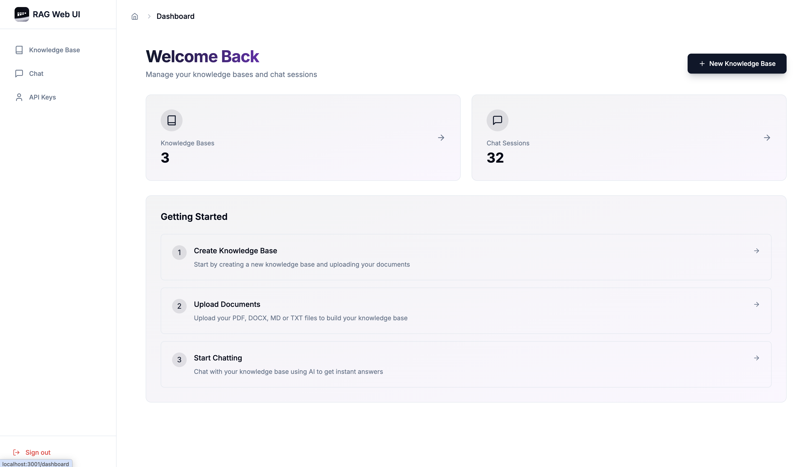
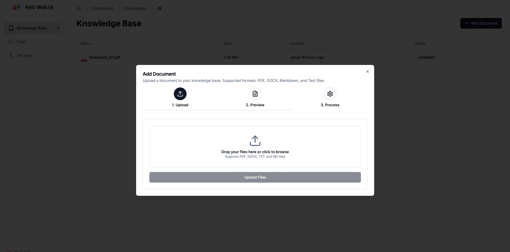
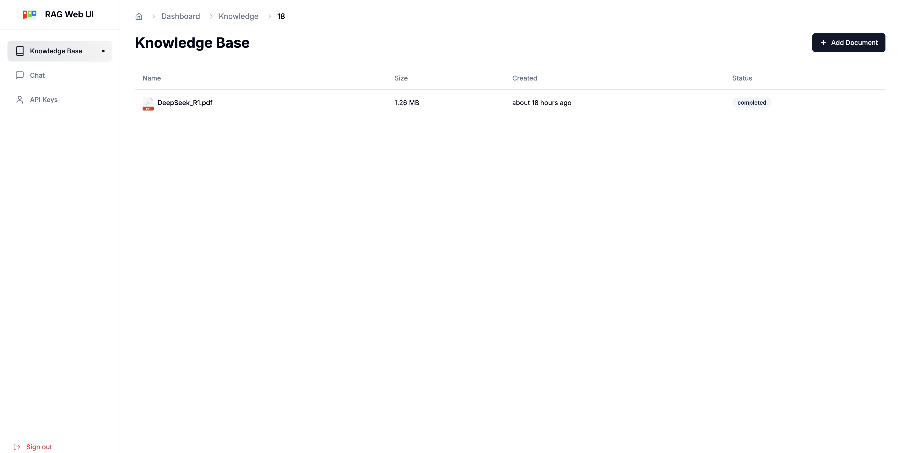
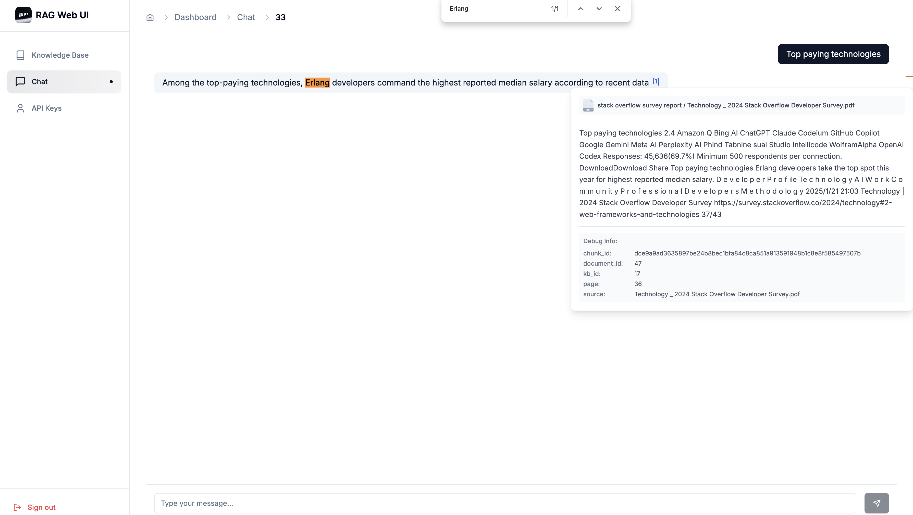
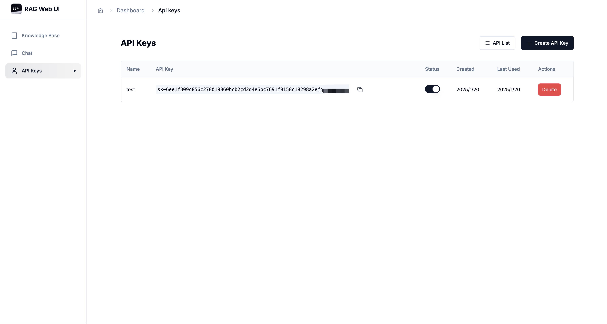
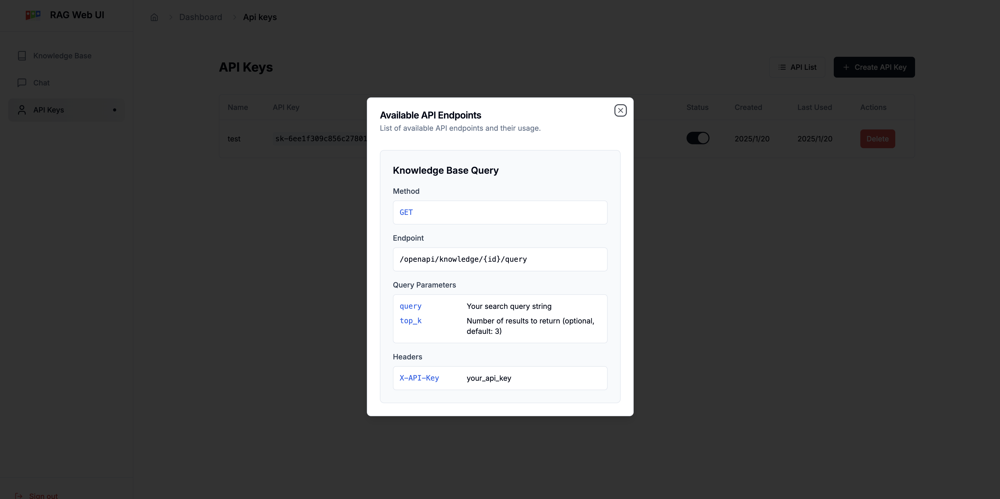
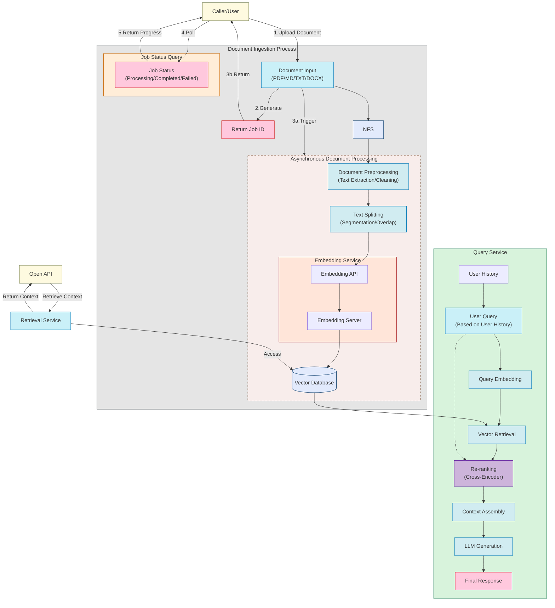

<div align="center">
  
  <br />
  <p>
    <strong>Knowledge Base Management Based on RAG (Retrieval-Augmented Generation)</strong>
  </p>

  <p>
    <a href="https://github.com/rag-web-ui/rag-web-ui/blob/main/LICENSE"></a>
    <a href="#"></a>
    <a href="#"></a>
    <a href="#"></a>
  </p>

  <p>
    <a href="#features">Features</a> •
    <a href="#quick-start">Quick Start</a> •
    <a href="#deployment-guide">Deployment</a> •
    <a href="#architecture">Architecture</a> •
    <a href="#development">Development</a> •
    <a href="#contributing">Contributing</a>
  </p>

  <h4>
    <span>English</span> |
    <a href="README.zh-CN.md">简体中文</a>
  </h4>
</div>

## 📖 Introduction

RAG Web UI is an intelligent dialogue system based on RAG (Retrieval-Augmented Generation) technology. It helps enterprises and individuals build intelligent Q&A systems based on their own knowledge bases. By combining document retrieval and large language models, it delivers accurate and reliable knowledge-based question-answering services.

## ✨ Features
- 📚 **Intelligent Document Management**
  - Support for multiple document formats (PDF, DOCX, Markdown, Text)
  - Automatic document chunking and vectorization
  - Support for async document processing and incremental updates

- 🤖 **Advanced Dialogue Engine**
  - Precise retrieval and generation based on RAG
  - Support for multi-turn contextual dialogue
  - Support for reference citations in conversations

- 🎯 **Robust Architecture**
  - Frontend-backend separation design
  - Distributed file storage
  - High-performance vector database: Support for ChromaDB, Qdrant with easy switching through Factory pattern

## 🖼️ Screenshots

<div align="center">
  
  <p><em>Knowledge Base Management Dashboard</em></p>
  
  
  <p><em>Document Processing Dashboard</em></p>
  
  
  <p><em>Document List</em></p>
  
  
  <p><em>Intelligent Chat Interface with References</em></p>
  
  
  <p><em>API Key Management</em></p>

  
  <p><em>API Reference</em></p>
</div>

 ##  Project Flowchart
 


## 🚀 Quick Start

### Prerequisites

- Docker & Docker Compose v2.0+
- Node.js 18+
- Python 3.9+
- 8GB+ RAM

### Installation

1. Clone the repository
```bash
git clone https://github.com/rag-web-ui/rag-web-ui.git
cd rag-web-ui
```

2. Configure environment variables

Configure the docker-compose.yml file with your environment variables, especially:

- `SECRET_KEY`: Your JWT secret key for authentication
- `OPENAI_API_KEY`: Your OpenAI API key for LLM services
- `OPENAI_API_BASE`: OpenAI API base URL (default is https://api.openai.com/v1)
- `EMBEDDINGS_PROVIDER`: Embeddings service provider (default is openai)
- `OPENAI_MODEL`: OpenAI model to use (default is gpt-4)

You can find the full configuration options in the docker-compose.yml file.

3. Start services(development server)
```bash
docker compose up -d --build
```

### Verification

Access the following URLs after service startup:

- 🌐 Frontend UI: http://localhost:3000
- 📚 API Documentation: http://localhost:8000/redoc
- 💾 MinIO Console: http://localhost:9001

## 🏗️ Architecture

### Backend Stack

- 🐍 **Python FastAPI**: High-performance async web framework
- 🗄️ **MySQL + ChromaDB**: Relational + Vector databases
- 📦 **MinIO**: Distributed object storage
- 🔗 **Langchain**: LLM application framework
- 🔒 **JWT + OAuth2**: Authentication

### Frontend Stack

- ⚛️ **Next.js 14**: React framework
- 📘 **TypeScript**: Type safety
- 🎨 **Tailwind CSS**: Utility-first CSS
- 🎯 **Shadcn/UI**: High-quality components
- 🤖 **Vercel AI SDK**: AI integration

## 📈 Performance Optimization

The system is optimized in the following aspects:

- ⚡️ Incremental document processing and async chunking
- 🔄 Streaming responses and real-time feedback
- 📑 Vector database performance tuning
- 🎯 Distributed task processing

## 📖 Development Guide

### Backend Development

```bash
cd backend
python -m venv venv
source venv/bin/activate  # Linux/macOS
pip install -r requirements.txt
uvicorn app.main:app --reload
```

### Frontend Development

```bash
cd frontend
pnpm install
pnpm dev
```

### Database Migration

```bash
cd backend
alembic revision --autogenerate -m "migration message"
alembic upgrade head
```

## 🔧 Configuration

### Core Configuration

| Parameter                   | Description                                                             | Default               | Required |
| --------------------------- | ----------------------------------------------------------------------- | --------------------- | -------- |
| MYSQL_SERVER                | MySQL Server Address                                                    | localhost             | ✅        |
| MYSQL_USER                  | MySQL Username                                                          | postgres              | ✅        |
| MYSQL_PASSWORD              | MySQL Password                                                          | postgres              | ✅        |
| MYSQL_DATABASE              | MySQL Database Name                                                     | ragwebui              | ✅        |
| SECRET_KEY                  | JWT Secret Key                                                          | -                     | ✅        |
| ACCESS_TOKEN_EXPIRE_MINUTES | JWT Token Expiry (minutes)                                              | 30                    | ✅        |
| CHROMA_DB_HOST              | ChromaDB Server Address                                                 | localhost             | ✅        |
| CHROMA_DB_PORT              | ChromaDB Port                                                           | 8001                  | ✅        |
| EMBEDDINGS_PROVIDER         | Embeddings Service Provider                                             | openai                | ✅        |
| OPENAI_API_KEY              | OpenAI API Key (DeepSeek Compatible)                                    | -                     | ✅        |
| OPENAI_API_BASE             | OpenAI API Proxy URL (DeepSeek Compatible: https://api.deepseek.com/v1) | -                     | ❌        |
| OPENAI_MODEL                | OpenAI Model Name                                                       | gpt-4                 | ✅        |
| MINIO_ENDPOINT              | MinIO Server Address                                                    | localhost:9000        | ✅        |
| MINIO_ACCESS_KEY            | MinIO Access Key                                                        | minioadmin            | ✅        |
| MINIO_SECRET_KEY            | MinIO Secret Key                                                        | minioadmin            | ✅        |
| MINIO_BUCKET_NAME           | MinIO Bucket Name                                                       | documents             | ✅        |
| VECTOR_STORE_TYPE           | Vector Store Type                                                       | chroma                | ✅        |
| VECTOR_STORE_URL            | Vector Store URL For Qdrant                                             | http://localhost:6333 | ❌        |
| VECTOR_STORE_PREFER_GRPC    | Prefer gRPC Connection For Qdrant                                       | true                  | ❌        |

## 🤝 Contributing

We welcome community contributions!

### Contribution Process

1. Fork the repository
2. Create a feature branch (`git checkout -b feature/AmazingFeature`)
3. Commit changes (`git commit -m 'Add some AmazingFeature'`)
4. Push to branch (`git push origin feature/AmazingFeature`)
5. Create a Pull Request

### Development Guidelines

- Follow [Python PEP 8](https://pep8.org/) coding standards
- Follow [Conventional Commits](https://www.conventionalcommits.org/)


### 🚧 Roadmap

- [x] Knowledge Base API Integration
- [ ] Workflow By Natural Language
- [ ] Multi-path Retrieval
- [ ] Support Multiple Models
- [ ] Support Multiple Vector Databases

## 📄 License

This project is licensed under the [Apache-2.0 License](LICENSE)

## Note

This project is for learning and sharing RAG knowledge only. Please do not use it for commercial purposes. It is not ready for production use and is still under active development.

## 🙏 Acknowledgments

Thanks to these open source projects:

- [FastAPI](https://fastapi.tiangolo.com/)
- [Langchain](https://python.langchain.com/)
- [Next.js](https://nextjs.org/)
- [ChromaDB](https://www.trychroma.com/)


---

<div align="center">
  If this project helps you, please consider giving it a ⭐️
</div>
