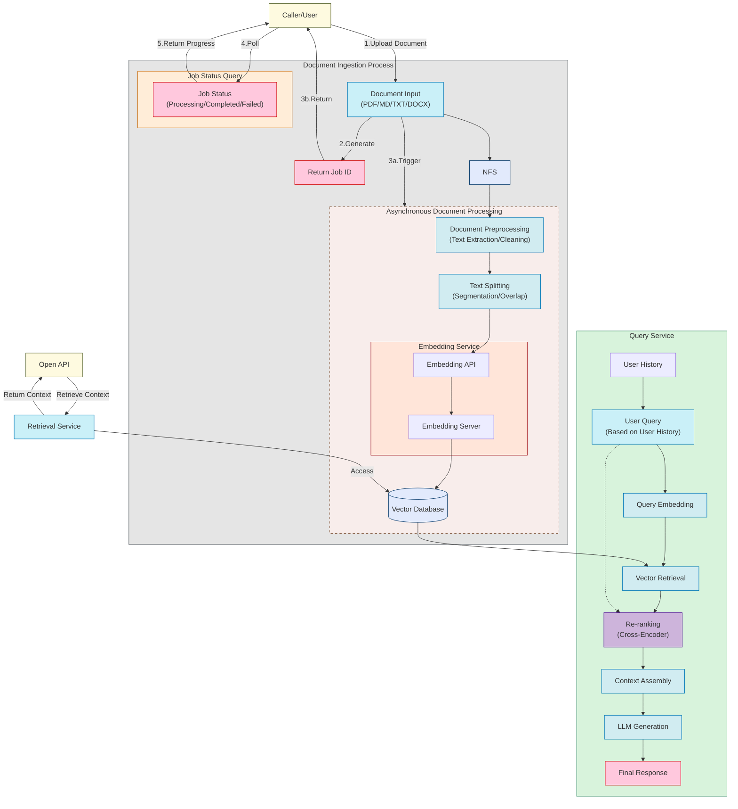

<div align="center">
  
  <br />
  <p>
    <strong>基于 RAG (Retrieval-Augmented Generation) 的知识库管理</strong>
  </p>

  <p>
    <a href="https://github.com/rag-web-ui/rag-web-ui/blob/main/LICENSE"></a>
    <a href="#"></a>
    <a href="#"></a>
    <a href="#"></a>
  </p>

  <p>
    <a href="#特性">特性</a> •
    <a href="#快速开始">快速开始</a> •
    <a href="#部署指南">部署指南</a> •
    <a href="#技术架构">技术架构</a> •
    <a href="#开发指南">开发指南</a> •
    <a href="#贡献指南">贡献指南</a>
  </p>

  <h4>
    <a href="README.md">English</a> |
    <span>简体中文</span>
  </h4>
</div>

## 📖 简介

RAG Web UI 是一个基于 RAG (Retrieval-Augmented Generation) 技术的智能对话系统，它能够帮助构建基于自有知识库的智能问答系统。通过结合文档检索和大语言模型，实现了准确、可靠的知识问答服务。

同时提供 OpenAPI 接口，方便用户通过 API 调用知识库。

你可以通过[RAG 教程](./docs/tutorial/README.md)来了解整个项目的实现流程。

## ✨ 特性
- 📚 **智能文档管理**
  - 支持多种文档格式 (PDF、DOCX、Markdown、Text)
  - 文档自动分块和向量化
  - 支持异步文档、增量处理

- 🤖 **先进的对话引擎**
  - 基于 RAG 的精准检索和生成
  - 支持上下文多轮对话
  - 支持对话中引用角标查看原文

- 🎯 **合理架构**
  - 前后端分离设计
  - 分布式文件存储
  - 高性能向量数据库: 支持 ChromaDB、Qdrant，通过 Factory 模式，可以方便的切换向量数据库

## 🖼️ 截图

<div align="center">
  
  <p><em>知识库管理 Dashboard</em></p>
  
  
  <p><em>文档处理 Dashboard</em></p>
  
  
  <p><em>文档列表</em></p>
  
  
  <p><em>带引用序号的智能对话界面</em></p>
  
  
  <p><em>API Key 管理</em></p>

  
  <p><em>API 参考</em></p>
</div>

 
## 项目流程图



## 🚀 快速开始

### 环境要求

- Docker & Docker Compose v2.0+
- Node.js 18+
- Python 3.9+
- 8GB+ RAM

### 安装步骤

1. 克隆项目
```bash
git clone https://github.com/rag-web-ui/rag-web-ui.git
cd rag-web-ui
```

2. 配置环境变量
```bash
cp backend/.env.example backend/.env
# 编辑 .env 文件，填写必要的配置项 （见下文）
```

3. 启动服务
```bash
docker-compose up -d
```

### 验证安装

服务启动后，可以通过以下地址访问：

- 🌐 前端界面: http://localhost:3000
- 📚 API 文档: http://localhost:8000/redoc
- 💾 MinIO 控制台: http://localhost:9001

## 🏗️ 技术架构

### 后端技术栈

- 🐍 **Python FastAPI**: 高性能异步 Web 框架
- 🗄️ **MySQL + ChromaDB**: 关系型数据库 + 向量数据库
- 📦 **MinIO**: 对象存储
- 🔗 **Langchain**: LLM 应用开发框架
- 🔒 **JWT + OAuth2**: 身份认证

### 前端技术栈

- ⚛️ **Next.js 14**: React 应用框架
- 📘 **TypeScript**: 类型安全
- 🎨 **Tailwind CSS**: 原子化 CSS
- 🎯 **Shadcn/UI**: 高质量组件库
- 🤖 **Vercel AI SDK**: AI 功能集成

## 📈 性能优化

系统在以下方面进行了性能优化：

- ⚡️ 文档增量处理和异步分块
- 🔄 流式响应和实时反馈
- 📑 向量数据库性能调优
- 🎯 分布式任务处理

## 📖 开发指南

### 后端开发

```bash
cd backend
python -m venv venv
source venv/bin/activate  # Linux/macOS
pip install -r requirements.txt
uvicorn app.main:app --reload
```

### 前端开发

```bash
cd frontend
pnpm install
pnpm dev
```

### 数据库迁移

```bash
cd backend
alembic revision --autogenerate -m "migration message"
alembic upgrade head
```

## 🔧 配置说明

### 核心配置项

| 配置项                      | 说明                                                                | 默认值                | 必填 |
| --------------------------- | ------------------------------------------------------------------- | --------------------- | ---- |
| MYSQL_SERVER                | MySQL 服务器地址                                                    | localhost             | ✅    |
| MYSQL_USER                  | MySQL 用户名                                                        | postgres              | ✅    |
| MYSQL_PASSWORD              | MySQL 密码                                                          | postgres              | ✅    |
| MYSQL_DATABASE              | MySQL 数据库名                                                      | ragwebui              | ✅    |
| SECRET_KEY                  | JWT 加密密钥                                                        | -                     | ✅    |
| ACCESS_TOKEN_EXPIRE_MINUTES | JWT token 过期时间(分钟)                                            | 30                    | ✅    |
| CHROMA_DB_HOST              | ChromaDB 服务器地址                                                 | localhost             | ✅    |
| CHROMA_DB_PORT              | ChromaDB 端口                                                       | 8001                  | ✅    |
| OPENAI_API_KEY              | OpenAI API 密钥 （DeepSeek 兼容）                                   | -                     | ✅    |
| OPENAI_API_BASE             | OpenAI API 代理 URL （DeepSeek 兼容： https://api.deepseek.com/v1） | -                     | ❌    |
| OPENAI_MODEL                | OpenAI 模型名称                                                     | gpt-4                 | ✅    |
| MINIO_ENDPOINT              | MinIO 服务器地址                                                    | localhost:9000        | ✅    |
| MINIO_ACCESS_KEY            | MinIO 访问密钥                                                      | minioadmin            | ✅    |
| MINIO_SECRET_KEY            | MinIO 密钥                                                          | minioadmin            | ✅    |
| MINIO_BUCKET_NAME           | MinIO 存储桶名称                                                    | documents             | ✅    |
| VECTOR_STORE_TYPE           | 向量存储类型                                                        | chroma                | ✅    |
| VECTOR_STORE_URL            | Qdrant 向量存储 URL                                                 | http://localhost:6333 | ❌    |
| VECTOR_STORE_PREFER_GRPC    | Qdrant 优先使用 gRPC 连接                                           | true                  | ❌    |

## 🤝 贡献指南

我们非常欢迎社区贡献！

### 贡献流程

1. Fork 本仓库
2. 创建特性分支 (`git checkout -b feature/AmazingFeature`)
3. 提交改动 (`git commit -m 'Add some AmazingFeature'`)
4. 推送到分支 (`git push origin feature/AmazingFeature`)
5. 创建 Pull Request

### 开发规范

- 遵循 [Python PEP 8](https://pep8.org/) 代码规范
- 遵循 [Conventional Commits](https://www.conventionalcommits.org/) 提交规范


### 🚧 Roadmap

- [x] Knowledge Base API Integration
- [ ] Workflow By Natural Language
- [ ] 多路召回
- [ ] 支持多模型
- [ ] 支持多向量数据库

## 补充

本项目仅用于学习交流 RAG ，请勿用于商业用途，不具备在生产环境使用的条件，还在持续开发中。

## 📄 许可证

本项目采用 [Apache-2.0 许可证](LICENSE)

## 🙏 致谢

感谢以下开源项目：

- [FastAPI](https://fastapi.tiangolo.com/)
- [Langchain](https://python.langchain.com/)
- [Next.js](https://nextjs.org/)
- [ChromaDB](https://www.trychroma.com/)

---

<div align="center">
  如果这个项目对你有帮助，请考虑给它一个 ⭐️
</div> 
