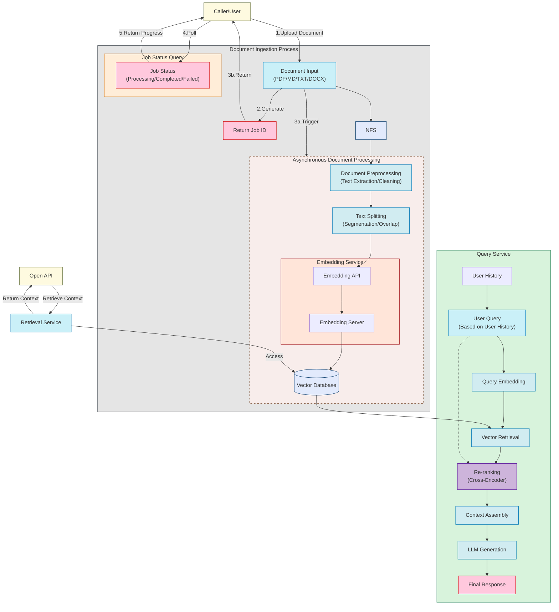
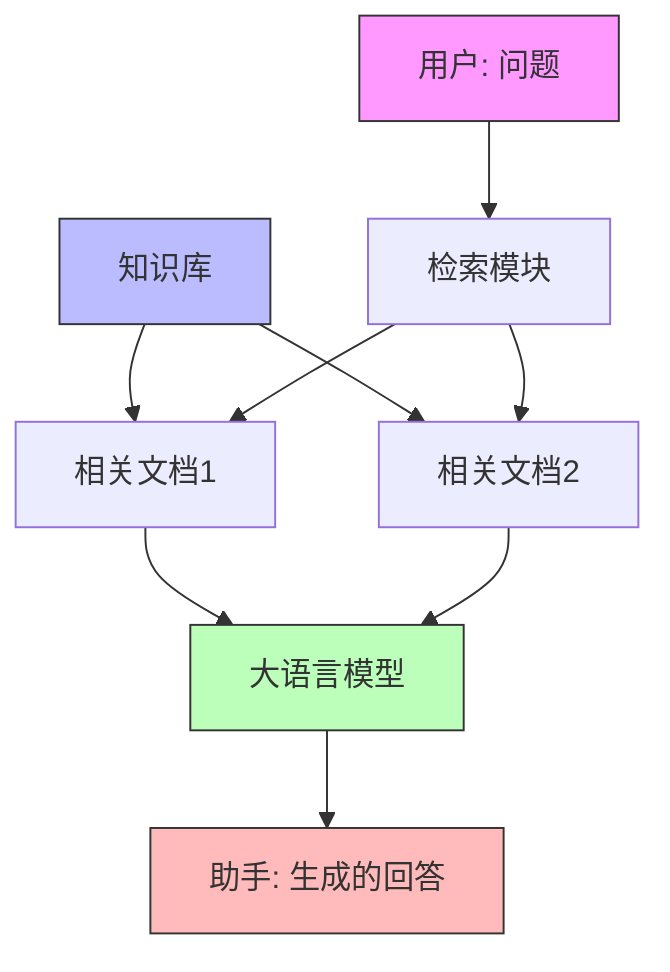
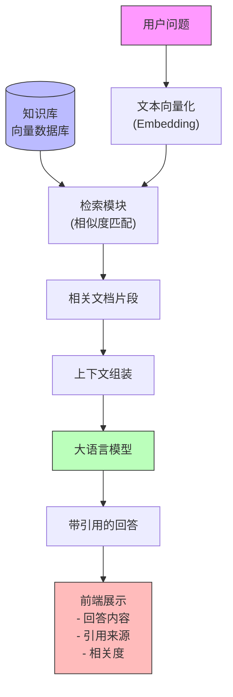

# 零基础入门：如何用 RAG (检索增强生成) 打造知识库 QA 系统

## 写在前面

马上今年要过去了，这个项目是在 2025 年 1 月份闲暇时间发起一个类似于教育类的项目。

其目的更多是希望可以在不依赖其他大的基础设施，结合自己多个 RAG 项目的经验，

用大家手头上已有的工具，通过跑通一个全流程的 RAG 知识库项目，来帮助更多的同学认识和入门 RAG 和知识库。

所以在这个项目里面，你当前还不会看到很多关于 RAG 的细节，例如多路召回、HyDE、Query 改写等能力（当然，我看到社区里面有能力的同学已经在帮忙实现这些能力 ING 了）。

项目流程图：



## 1. 认识 RAG：为什么要"检索 + 生成"

### 1.1 什么是 RAG

RAG 是 Retrieval-Augmented Generation 的缩写，中文翻译为"检索增强生成"。它是一种将检索系统和生成式 AI 模型结合的技术方案，主要包含两个核心步骤：

1. 检索（Retrieval）：根据用户输入的问题，从知识库中检索出相关的文档或信息片段
2. 生成（Generation）：将检索到的相关信息作为上下文，结合用户问题，让大语言模型生成准确的回答

这种方案既能让模型基于最新的知识作答，又可以提供可溯源的参考依据，有效解决了大语言模型的知识时效性和事实准确性问题。

下面这张图展示了 RAG 在对话过程中的工作流程:


### 1.2 为什么需要 RAG

让我们对比三种问答方案的优缺点，来理解为什么 RAG 是一个更好的选择：

1. 传统检索式问答 (Retrieval QA)
   - ✅ 可靠性高：答案直接来自知识库，有明确的来源
   - ✅ 知识可更新：添加新文档即可更新知识
   - ❌ 灵活性差：只能返回知识库中已有的内容
   - ❌ 表达生硬：难以用自然语言组织答案

2. 纯 LLM 问答
   - ✅ 表达自然：能用流畅的语言组织答案
   - ✅ 灵活理解：可以理解各种表达方式的问题
   - ❌ 知识固化：知识仅限于训练数据，无法及时更新
   - ❌ 可靠性差：容易产生幻觉，难以验证答案准确性

3. RAG 方案
   - ✅ 可靠且可溯源：答案基于检索到的具体文档
   - ✅ 知识可更新：可以持续添加新的知识
   - ✅ 表达自然：利用 LLM 的语言能力组织答案
   - ✅ 灵活理解：能理解各种形式的问题
   - ✅ 成本可控：主要消耗在必要的 API 调用上

RAG 通过将检索和生成相结合，既保留了传统检索问答的可靠性，又获得了 LLM 的灵活性和自然表达能力。它能让 AI 始终基于最新的、可信的知识来回答问题，同时保持对话的流畅自然。

RAG 的典型应用场景

- 企业知识库问答：帮助企业构建对内员工知识库或对外客户问答系统。
- 法律法规、论文等参考场景：需要给出权威来源或证据的回答。
- 任何需要"带有引用信息"的回答场景。


## 2. RAG 系统整体架构与数据流

### 2.1 核心组件

- 向量数据库：用来存储文档分块后的向量（如 ChromaDB、Qdrant）。
- Embedding（文本向量化）：将文本转化为可比较的数值向量，形如 [0.1, 0.2, 0.3, 0.4, 0.5]
- 检索 (Retrieval)：根据用户查询的向量相似度，检索出最相关的文档切片。
- 大语言模型：将检索到的上下文与用户问题组合，再由模型 (LLM) 生成最终答案。
- 生成 (Generation) 与引用：如何在回答中嵌入引用链接或标注，方便用户溯源。

### 2.2 RAG 的典型工作流

1) 用户输入问题。
2) 将问题向量化，然后检索最相似的文档切片。
3) 将检索到的上下文与问题拼接后输入 LLM。
4) LLM 输出带引用信息的回答。
5) 前端渲染回答、可选地在可视化界面中展示引用详情。

下面用一张图展示各个组件的交互流程：


## 3. 构建知识库：文档处理、嵌入、存储

### 3.1 文档上传与分块 (Chunking)

#### 3.1.1 为什么要对文档进行分块？
文档分块是 RAG 系统中的一个关键步骤，主要有以下几个原因：

1. 向量相似度计算的精度
- 过长的文本会导致向量表示不够精确
- 较小的文本块能更好地捕捉局部语义
- 有助于提高检索的准确性

2. LLM 的上下文窗口限制
- LLM 的输入长度是有限的 （虽然 Qwen 已经退出了 1M token 的上下文窗口 0.0）
- 需要将文档切分为适合 LLM 处理的大小
- 避免超出 token 限制导致信息丢失

2. 检索效率与成本
- 更小的文本块便于建立细粒度的索引
- 只需检索最相关的片段，节省 token 用量
- 减少无关信息，提高回答质量

4. 引用与溯源 （这个是 RAG 的特色功能）
- 便于定位信息的具体来源
- 可以给出更精确的引用范围
- 有助于用户验证答案的可靠性

#### 3.1.2 常见的分块策略

1. 固定长度分块
- 按字符数或 token 数进行切分
- 实现简单，但可能切断语义完整的段落
- 适合结构统一的文档

2. 语义分块
- 按段落、章节等自然语义单位切分
- 保持上下文的连贯性
- 需要考虑文档的具体结构

3. 重叠分块
- 相邻块之间保留一定重叠
- 避免关键信息被切分
- 增加了存储和计算开销

4. 递归分块
- 先大块后细分
- 保持层次结构
- 适合长文档处理

选择合适的分块策略需要考虑：
- 文档的类型和结构
- 向量数据库的特性
- LLM 的上下文窗口大小
- 检索效率与成本的平衡

例如如果是 markdown，可以按段落进行分块，如果是一般文档，可以按章节进行分块。
```
+--------------------------------------------------+
|  # 第一章标题                                      |
|  正文内容...                                       |
|  正文内容...                                       |
|                                                  |
|  ## 1.1 小节标题                                  |
|  - 列表项 1                                       |
|  - 列表项 2                                       |
|                                                  |
|  ### 1.1.1 子节标题                               |
|  正文段落...                                      |
|                                                  |
|  # 第二章标题                                     |
|  另一段正文...                                    |
+--------------------------------------------------+
                    |
                    v
              语义分块处理
                    |
                    v
+------------------+  +-------------------+  +------------------+
| 块 1:            |  | 块 2:              |  | 块 3:            |
| # 第一章标题      |  | ## 1.1 小节标题     |  | # 第二章标题       |
| 正文内容...       |  | - 列表项 1         |  | 另一段正文...      |
| 正文内容...       |  | - 列表项 2         |  |                   |
+------------------+  |                   |  +------------------+
                      | ### 1.1.1 子节标题 |
                      | 正文段落...        |
                      +-------------------+
```

### 3.2 文本向量化 (Embedding)

文本向量化是将自然语言文本转换为高维向量空间中的数值向量的过程。这种转换使得我们可以：
- 用数学方法计算文本之间的语义相似度
- 在向量空间中进行高效的相似度搜索
- 保留文本的语义信息和上下文关系

常用的文本向量化模型包括：

1. OpenAI Embeddings
- text-embedding-ada-002 模型
- 1536 维向量输出
- 适用于英文等多种语言
- 语义表达能力强

2. Sentence Transformers
- 开源的句子级别编码器
- 支持多语言
- 可以根据场景微调
- 计算效率高

在 RAG Web UI 中，主要是用的 OpenAI 的 text-embedding-ada-002 模型。

```python
from langchain_openai import OpenAIEmbeddings
...

embeddings = OpenAIEmbeddings(
    openai_api_key=settings.OPENAI_API_KEY,
    openai_api_base=settings.OPENAI_API_BASE
)
```

## 3.3 向量数据库

在文本 Embedding 之后，需要将向量存储到向量数据库中，以便后续的检索和相似度计算。

在 RAG Web UI 中，主要是用的 ChromaDB 作为向量数据库， 同时支持使用 Factory 模式， 支持多种向量数据库，例如：

1. ChromaDB
2. Qdrant
3. Milvus
4. Faiss
5. Annoy
6. Pinecone
7. Zilliz


量数据库除了存储向量，还要携带某些元信息(文档来源、段落位置等)方便查阅， 一般情况下，我们会存入这样的数据结构到向量数据库中：

除了向量之外， 我们还需要存入一些元数据， 例如：

```python
{
    "id": "chunk_id",
    "text": "段落内容",
    "metadata": {"source": "文档来源", "position": "段落位置", "hash": "段落哈希值"}
}
```


## 4. 检索与重排序：用最相关的上下文喂给大模型

### 4.1 相似度检索 (Similarity Search)

常用的相似度度量：余弦相似度、向量距离 (欧几里得距离) 等。

ChromaDB 支持多种相似度计算方法:

1. Cosine Similarity (余弦相似度)
- 计算两个向量夹角的余弦值
- 值域范围为 [-1,1]，越接近 1 表示越相似
- 不受向量长度影响，只关注方向
- 计算公式: cos(θ) = (A·B)/(||A||·||B||)

2. L2 Distance (欧氏距离)
- 计算两个向量间的直线距离
- 值越小表示越相似
- 受向量长度影响
- 计算公式: d = √(Σ(ai-bi)²)

3. IP (Inner Product, 内积)
- 两个向量对应位置相乘后求和
- 值越大表示越相似
- 受向量长度影响
- 计算公式: IP = Σ(ai×bi)

ChromaDB 默认使用 Cosine Similarity，这也是最常用的相似度计算方法，因为:
- 计算简单高效
- 不受向量绝对大小影响
- 对于文本语义相似度计算效果好
- 结果容易解释和标准化

在实际使用中，可以根据具体场景选择合适的相似度算法:
- 如果向量已归一化，三种方法等价
- 对向量长度敏感时选择 Cosine
- 关注绝对距离时选择 L2
- 需要快速计算时可用 IP

### 4.2 重排序 (Re-ranking) 重要吗？

重排序是一个重要的步骤，可以显著提升检索结果的质量。其工作原理如下：

1. 初步检索
- 首先使用向量相似度搜索召回一批候选文档(如前20-100条)
- 这一步计算快速但可能不够精确

2. Cross-Encoder 重排序
- 对召回的候选文档进行更精细的相关性打分
- Cross-Encoder 会同时看到 query 和文档内容，计算它们的匹配度
- 相比向量相似度，能更好地理解语义关联
- 但计算开销较大，所以只用于重排少量候选

3. 应用场景
- 多路召回：不同检索方式召回的结果需要统一排序
- 高精度要求：需要更准确的相关性排序
- 复杂查询：简单向量相似度可能不足以理解查询意图

4. 常见实现
- 使用预训练的 Cross-Encoder 模型(如 BERT)
- 可以针对具体任务进行微调
- 输出相关性分数用于重新排序

虽然重排序会增加一定延迟，但在对准确度要求较高的场景下，这个成本通常是值得的。

## 4.3 拼接上下文与用户问题

在检索到相关文档片段后，需要将它们与用户问题拼接成合适的 prompt，以供 LLM 生成回答。

用户问题 + 检索到的上下文 = Prompt，最终由 LLM 输出回答。

以下是一些常见的拼接策略：

1. 基本结构
- System: 系统指令，说明 AI 助手的角色和任务
- Context: 检索到的相关文档片段
- Human: 用户的实际问题
- Assistant: AI 的回答

2. 拼接技巧

我们在项目中做了一个有意思的事情，就是可以使用 `[[citation:1]]` 这样的格式来引用检索到的上下文。

然后用户可以在前端通过 Markdown 的格式来展示引用信息, 并且通过弹窗来展示引用详情。


在 RAG Web UI 中， 我们使用 LangChain 的模板来实现这个功能：

可查阅： `backend/app/services/chat_service.py`

```python 
from langchain.prompts import PromptTemplate

qa_system_prompt = (
      "You are given a user question, and please write clean, concise and accurate answer to the question. "
      "You will be given a set of related contexts to the question, which are numbered sequentially starting from 1. "
      "Each context has an implicit reference number based on its position in the array (first context is 1, second is 2, etc.). "
      "Please use these contexts and cite them using the format [citation:x] at the end of each sentence where applicable. "
      "Your answer must be correct, accurate and written by an expert using an unbiased and professional tone. "
      "Please limit to 1024 tokens. Do not give any information that is not related to the question, and do not repeat. "
      "Say 'information is missing on' followed by the related topic, if the given context do not provide sufficient information. "
      "If a sentence draws from multiple contexts, please list all applicable citations, like [citation:1][citation:2]. "
      "Other than code and specific names and citations, your answer must be written in the same language as the question. "
      "Be concise.\n\nContext: {context}\n\n"
      "Remember: Cite contexts by their position number (1 for first context, 2 for second, etc.) and don't blindly "
      "repeat the contexts verbatim."
  )
```

## 6. 工程实战示例：RAG 在知识库 QA 中的流程

To be continued...